# Inveate

Inveate /in-vee-ayt/ is a local-first AI workbench for LM Studio users who want full control over the application layer — with a highly configurable RAG pipeline ready to go, and designed for future extensions such as custom parsers, sideloaded tools, workflow runners, and local agent experiments.

Inveate’s application server is a local AI application layer. It sits between user I/O, local model servers, vector databases, and parsers, providing a place to implement the logic — including new toolchains — that should not live inside the model itself: retrieval, prompt construction, context management, workflow routing, tool integration, and response streaming.

In present configuration, Inveat is ideal for LM Studio users who need a more configurable RAG pipeline using more advanced embedding models, parsers, higher retrieval limits, and so on

## 🏗️ Architecture

```
┌─────────────────┐     ┌──────────────────┐     ┌─────────────────┐
│  Ingestion      │────▶│  Application     │────▶│  Client         │
│  Script         │     │  Server          │     │  Interface      │
│  (step1*.py)    │     │  (step2*.py)     │     │  (step3*.py)    │
└─────────────────┘     └──────────────────┘     └─────────────────┘
         │                       │
         ▼                       ▼
   ChromaDB Vector          LM Studio
   Database                 LLM Server
```

## 🚀 Quick Start

## Recommended: use a Python virtual environment

Inveate is intended to be run inside a project-local Python virtual environment. This is especially recommended on Linux, where the system Python is often managed by the OS package manager.

```bash
python3 -m venv .venv
source .venv/bin/activate  #Your virtual environment is now active in the terminal, now should install any requirements
python -m pip install --upgrade pip
```
### 1. Install Dependencies

Choose your hardware profile (see [INSTALLATION_GUIDE.md](INSTALLATION_GUIDE.md) for details):

```bash
# For NVIDIA GPU users (recommended)
pip install -r requirements-core.txt
pip install -r requirements-cuda.txt

# For CPU/AMD/Intel/Mac users
pip install -r requirements-core.txt
```

### 2. Configure Settings

From console, issue: cp config.example.yaml config.yaml
Next, edit `config.yaml` to match your environment:

- **Paths**: Adjust source directory, ChromaDB location, and model paths. This is optional and git folder names match config.
- **LM Studio**: Verify connection settings (default: localhost:1234)
- **Context Limits**: Tune based on your GPU VRAM capacity and LMStudio model loader configuratiion
- **Embedding Model**: Point to your local BGE or other embedding model. Must be the safetensors ("unquantized") format. 
The model Inveate was tested with can be found here:
https://huggingface.co/BAAI/bge-large-en-v1.5

For clarity, your embedding model directory, should look something like this:
```text
local_models
└── bge-large-en-v1.5
    ├── 1_Pooling
    │   └── config.json
    ├── config.json
    ├── config_sentence_transformers.json
    ├── model.safetensors
    ├── modules.json
    ├── onnx
    │   └── model.onnx
    ├── pytorch_model.bin
    ├── README.md
    ├── sentence_bert_config.json
    ├── special_tokens_map.json
    ├── tokenizer_config.json
    ├── tokenizer.json
    └── vocab.txt
```
### 3. Prepare Your Data

Place documents in the configured source directory (`./data` by default):

```bash
mkdir data
# Add .txt, .csv, .pdf, .docx files here
```

For example:
```text
data
├── customers_example.csv
└── leads_example.csv
```
### 4. Run Ingestion Pipeline

*note you may have the include the python version in the following calls, ie. python3 step1_ingest.py, depending how your paths are set up!*

```bash
python step1_ingest.py
```

This will:
- Parse all documents in the source directory
- Split into chunks based on your configuration
- Generate embeddings and store in ChromaDB

### 5. Start Application Server

In same terminal as above:

```bash
python step2_appserver.py
```

The server will start at `http://127.0.0.1:8000` with a `/health` endpoint for monitoring.

### 6. Load desired LLM into LMStudio, verify server mode is enabled and running at configured port (ie. 1234 is default)

### 7. Launch Client Interface

In a second terminal:

```bash
python step3_chatclient.py
```

Type your prompts and enjoy streaming responses!

## ⚙️ Configuration

All settings are managed in `config.yaml`. Key sections include:

| Section | Purpose | Default |
|---------|---------|---------|
| `paths` | Directory locations for data, DB, models | ./data, ./chroma_db, ./local_models |
| `collection` | Vector database collection name & settings | manual_rag_collection |
| `loaders` | Supported file extensions and parser options | txt, csv, pdf, docx |
| `chunking` | Text splitting strategy and sizes | 900 chars / 150 overlap |
| `embedding` | Model path, device (CPU/CUDA), batch size | bge-large-en-v1.5 / cuda |
| `retrieval` | Number of documents to fetch per query | 6 |
| `context` | Context window limits and guardrails | 131072 tokens |
| `lmstudio` | LLM server connection settings | localhost:1234 |
| `server` | FastAPI application configuration | 127.0.0.1:8000 |

### Environment Variable Overrides

For deployment flexibility, you can override certain settings via environment variables:

```bash
export LM_STUDIO_BASE_URL=http://localhost:1234/v1
export SERVER_PORT=9000
python 2_ApplicationServer.py
```

See `.env.example` for a complete list. The system automatically loads any `.env` file in the project root directory.

## 🛠️ Hardware Optimization Notes

### CPU (x86 64-bit)
- Ingestion script uses multiprocessing with configurable worker count
- Embedding generation runs on specified device (CPU or CUDA)

### GPU (NVidia Ampere Onward)
- ChromaDB embeddings can leverage CUDA for faster vectorization
- LM Studio should be configured appropriately under hardware settings for multi-gpu support

### VRAM Management
- Context guardrail prevents OOM by trimming context before sending to LLM
- Reserved generation tokens account for model thinking budget
- Adjust `context.max_system_context` and `context.reserved_generation_tokens` based on GPU capacity

## 🔧 Customization Options

### Adding New Document Types
1. Install the appropriate parser library
2. Add extension mapping in `get_loader_for_file()` (IngestionScript.py)
3. Update `loaders.enabled_extensions` in config.yaml

### Modifying Embedding Model
1. Place model files in configured `local_models_dir` (config.YAML)
2. Set `embedding.model_name` to point to your model
3. Restart server for changes to take effect

### Custom Retrieval Strategies
- Adjust `retrieval.top_k` for more/fewer context documents
- Enable metadata filtering via config options (requires ChromaDB advanced features)

## 📊 API Endpoints

| Endpoint | Method | Description |
|----------|--------|-------------|
| `/query` | POST | Submit query with optional chat history |
| `/health` | GET | Check server health and configuration |

### Request Format (POST /query)

```json
{
  "query": "Your prompt here",
  "history": [
    {"role": "user", "content": "..."},
    {"role": "assistant", "content": "..."}
  ]
}
```

## ⚠️ Known Limitations & Considerations

1. **Token Counting**: Currently uses cl100k_base (GPT tokenizer). For Gemma or other models, accuracy may vary by ~15-25%. Adjust `context.reserved_generation_tokens` accordingly.

2. **Session Persistence**: Optional JSON-based persistence in client interface. Not recommended for multi-client deployments.

3. **ChromaDB Locking**: PersistentClient holds file locks. Ensure ingestion completes before querying, or use separate ChromaDB paths.

4. **Model Swapping**: Changing the LLM model requires updating `lmstudio.model` and may require adjusting context parameters.

5. **History Trimming**: Client and server now use consistent trimming logic (max_turns * 2 = raw message count).

## Architecture
Inveate is organized around three small modules: an ingest pipeline that builds a local vector store, an application server that performs retrieval and prompt assembly, and a chat client that provides user I/O and conversational history. 

The parsing, normalization, chunking, embedding, retrieval, and model backend stages are intentionally visible so developers can modify or replace them.

Normalization converts parser-specific output into Inveate's standard internal document format: a JSON-like record containing extracted text plus consistent metadata such as filename, file type, page/document index, source path, and later chunk index. This keeps downstream chunking, embedding, ID generation, and ChromaDB storage independent of which parser backend produced the text. 

In this manner parsing can be readily changed in future (ie. swapping out the LangChain parser for Docling), without downstream complications.

```mermaid
flowchart LR
    %% ============================================================
    %% Ingest Module
    %% ============================================================
    subgraph INGEST["Ingest Module"]
        docs["Source Documents<br/>TXT / CSV / PDF / DOCX"]

        parse["Parsing Layer<br/>Current: LangChain loaders<br/>Future: Docling / custom parsers"]

        normalize["Normalize<br/>text + metadata"]

        chunk["Chunking<br/>RecursiveCharacterTextSplitter<br/>size + overlap from config"]

        embed["Embedding<br/>SentenceTransformers<br/>local BGE model"]

        ids["Stable Chunk IDs<br/>source + page/doc + chunk + hash"]

        docs --> parse
        parse --> normalize
        normalize --> chunk
        chunk --> embed
        chunk --> ids
    end

    %% ============================================================
    %% Shared Local Storage
    %% ============================================================
    subgraph STORAGE["Local Storage"]
        chroma["ChromaDB<br/>persistent vector store<br/>vectors + text + metadata"]
        config["config.yaml<br/>paths, parsing, chunking,<br/>embedding, retrieval, context, chat"]
    end

    %% ============================================================
    %% Application Server
    %% ============================================================
    subgraph SERVER["Application Server"]
        fastapi["FastAPI<br/>/query + /health"]

        retrieve["Retriever<br/>ChromaDB top-k search"]

        context["Context Builder<br/>retrieved chunks + chat history"]

        guardrail["Token Guardrail<br/>context window budgeting + trimming"]

        prompt["Prompt Assembly<br/>system prompt + history + RAG context"]

        lmclient["AsyncOpenAI Client<br/>OpenAI-compatible LM Studio API"]

        fastapi --> retrieve
        retrieve --> context
        context --> guardrail
        guardrail --> prompt
        prompt --> lmclient
    end

    %% ============================================================
    %% Client Chat
    %% ============================================================
    subgraph CLIENT["Client Chat"]
        user["User"]

        client["Terminal Chat Client<br/>streaming output"]

        history["Local Chat History<br/>turn memory + thinking-tag stripping"]

        user --> client
        client <--> history
    end

    %% ============================================================
    %% LM Studio
    %% ============================================================
    subgraph LMSTUDIO["LM Studio Model Server"]
        lmapi["OpenAI-Compatible API<br/>localhost:1234/v1"]
        llm["Local LLM<br/>Gemma / Qwen / Llama / etc."]

        lmapi --> llm
    end

    %% ============================================================
    %% Cross-module flow
    %% ============================================================

    %% Ingest writes vector DB
    embed -->|"embeddings"| chroma
    ids -->|"IDs + metadata"| chroma

    %% Client talks to app server
    client -->|"HTTP POST /query<br/>requests + streaming response"| fastapi

    %% Server retrieves from storage
    chroma -->|"retrieved chunks + metadata"| retrieve

    %% Server talks to LM Studio
    lmclient -->|"chat.completions<br/>stream=true"| lmapi
    llm -->|"streamed tokens"| lmapi
    lmapi -->|"streamed tokens"| lmclient
    lmclient -->|"FastAPI StreamingResponse"| client

    %% Config influences all major modules
    config -.-> INGEST
    config -.-> SERVER
    config -.-> CLIENT
```



## 🤝 Contributing

Pull requests welcome! Please ensure:
- Configuration changes are backward compatible
- New features respect the config-driven architecture
- Tests pass for modified components


## 📄 License

This project is licensed under the MIT License. See [LICENSE](LICENSE) for details.

---

Built with ❤️ for high-performance local AI workflows
