# Inveate

Inveate /in-vee-ayt/ is a local-first AI workbench for LM Studio users who want full control over the application layer — with a highly configurable RAG pipeline (LangChain, a user selected embedding model, ChromaDB) ready to go, and designed for future extensions such as custom parsers, sideloaded tools, workflow runners, and local agent experiments.

Inveate’s application server acts as a local AI orchestration layer. It sits between user I/O, local model runner, vector databases, and parsers, providing a place to implement the logic — including new toolchains — that should not live inside the model itself: retrieval, prompt construction, context management, workflow routing, tool integration, and response streaming.

In present configuration, Inveate is ideal for LM Studio users who need a more configurable RAG pipeline utilizing more advanced embedding models, flexible parsers, higher retrieval limits and finer context control. 

## 📋 Prerequisites

- Python `3.10+` recommended
- [LM Studio](https://lmstudio.ai/) installed & configured for local server mode
- (Optional) NVIDIA GPU with CUDA 12.x drivers for accelerated embedding generation
- Embedding model downloaded and placed in the local_models directory. Must be the safetensors ("unquantized") format. 
The model Inveate was tested with can be found here:
https://huggingface.co/BAAI/bge-large-en-v1.5

For clarity, your embedding model directory should look something like this:
```text
local_models
└── bge-large-en-v1.5
    ├── 1_Pooling
    │   └── config.json
    ├── config.json
    ├── config_sentence_transformers.json
    ├── model.safetensors
    ├── modules.json
    ├── onnx
    │   └── model.onnx
    ├── pytorch_model.bin
    ├── README.md
    ├── sentence_bert_config.json
    ├── special_tokens_map.json
    ├── tokenizer_config.json
    ├── tokenizer.json
    └── vocab.txt
```
## 🏗️ Architecture

Inveate is organized around three lightweight modules: an ingestion pipeline that builds a local vector store, an application server that handles retrieval and prompt assembly, and a chat client that manages user I/O and conversational history.

The parsing, normalization, chunking, embedding, retrieval, and model backend stages are intentionally exposed so developers can modify or replace them without breaking downstream components. Normalization converts parser-specific output into Inveate's JSON-like internal document format (text + consistent metadata), keeping chunking, ID generation, and ChromaDB storage independent of the parsing backend.

```mermaid
flowchart LR
    subgraph INGEST["Ingest Module"]
        docs["Source Documents<br/>TXT / CSV / PDF / DOCX"]
        parse["Parsing Layer<br/>LangChain loaders"]
        normalize["Normalize<br/>text + metadata"]
        chunk["Chunking<br/>Recursive splitter"]
        embed["Embedding<br/>SentenceTransformers"]
        ids["Stable Chunk IDs<br/>source + page + hash"]
        
        docs --> parse --> normalize --> chunk --> embed
        chunk --> ids
    end

    subgraph STORAGE["Local Storage"]
        chroma["ChromaDB<br/>persistent vector store"]
        config["config.yaml<br/>centralized settings"]
    end

    subgraph SERVER["Application Server"]
        fastapi["FastAPI<br/>/query + /health"]
        retrieve["Retriever<br/>top-k search"]
        context["Context Builder<br/>chunks + history"]
        guardrail["Token Guardrail<br/>budgeting + trimming"]
        prompt["Prompt Assembly<br/>system + RAG context"]
        lmclient["AsyncOpenAI Client<br/>LM Studio API"]

        fastapi --> retrieve --> context --> guardrail --> prompt --> lmclient
    end

    subgraph CLIENT["Client Chat"]
        user["User"]
        client["Terminal CLI<br/>streaming output"]
        history["Local History<br/>turn memory + tag stripping"]
        
        user --> client <--> history
    end

    subgraph LMSTUDIO["LM Studio Model Server"]
        lmapi["OpenAI-Compatible API<br/>localhost:1234/v1"]
        llm["Local LLM<br/>Gemma / Qwen / Llama / etc."]
        
        lmapi --> llm
    end

    embed -->|"embeddings"| chroma
    ids -->|"IDs + metadata"| chroma
    client -->|"HTTP POST /query"| fastapi
    chroma -->|"retrieved chunks"| retrieve
    lmclient -->|"chat.completions<br/>stream=true"| lmapi
    llm -->|"streamed tokens"| lmapi
    lmapi -->|"FastAPI StreamingResponse"| client
    
    config -.-> INGEST
    config -.-> SERVER
    config -.-> CLIENT
```



## 🚀 Quick Start

### 1. Setup Virtual Environment
Inveate is intended to run inside a project-local Python virtual environment:
```bash
python -m venv .venv
source .venv/bin/activate  # Windows: .venv\Scripts\activate
pip install --upgrade pip
```

### 2. Install Dependencies
Choose your hardware profile (see [INSTALLATION_GUIDE.md](INSTALLATION_GUIDE.md) for details):
```bash
# NVIDIA GPU users (recommended)
pip install -r requirements-core.txt -r requirements-cuda.txt

# CPU / AMD / Intel / Apple Silicon users
pip install -r requirements-core.txt
```

### 3. Configure Settings
Edit `config.yaml` directly to match your environment:
- **Paths**: Adjust source directory, ChromaDB location, and model paths (defaults work out-of-the-box)
- **LM Studio**: Verify connection settings (default: `localhost:1234`)
- **Context Limits**: Tune based on your GPU VRAM capacity
- **Embedding Model**: Point to a local folder under `local_models/` or use a HuggingFace ID (e.g., `BAAI/bge-large-en-v1.5`)
- **Retrieval**: Number of documents to fetch per query


### 4. Prepare Your Data
Place documents in the configured source directory (`./data` by default). Remove *_example.csv files if not just testing.

### 5. Run Ingestion Pipeline
```bash
python step1_ingest.py
```
*Parses documents, splits into chunks, generates embeddings, and stores them in ChromaDB.*

### 6. Start LM Studio
Load your desired model, enable **Local Server** mode (default port `1234`), and ensure the OpenAI-compatible API is active. The server must be running before querying.

### 7. Start Application Server
In same terminal as above:
```bash
python step2_appserver.py
```
*Server runs at `http://127.0.0.1:8000`. A `/health` endpoint is available for monitoring.*

### 8. Launch Chat Client
Open a second terminal and run:
```bash
python step3_chatclient.py
```
Type your prompts and enjoy streaming RAG responses!

## ⚙️ Configuration

All settings are managed in `config.yaml`. Key sections include:

| Section | Purpose | Default |
|---------|---------|---------|
| `paths` | Directory locations for data, DB, models | `./data`, `./chroma_db`, `./local_models` |
| `collection` | Vector database collection name & settings | `manual_rag_collection` |
| `loaders` | Supported file extensions and parser options | `.txt`, `.csv`, `.pdf`, `.docx` |
| `chunking` | Text splitting strategy and sizes | 900 chars / 150 overlap |
| `embedding` | Model path, device (CPU/CUDA), batch size | `bge-large-en-v1.5` / `cuda` |
| `retrieval` | Number of documents to fetch per query | 6 |
| `context` | Context window limits and guardrails | 131072 tokens |
| `lmstudio` | LLM server connection settings | `localhost:1234` |
| `server` | FastAPI application configuration | `127.0.0.1:8000` |

### Environment Variable Overrides
For deployment flexibility, you can override certain settings via environment variables (automatically loaded from `.env` if present):

```bash
export LM_STUDIO_BASE_URL=http://localhost:1234/v1
export SERVER_PORT=9000
export SOURCE_DIR=/path/to/custom/data
python step2_appserver.py
```
Supported overrides: `LM_STUDIO_BASE_URL`, `LM_STUDIO_API_KEY`, `SERVER_HOST`, `SERVER_PORT`, `SOURCE_DIR`, `CHROMA_PATH`, `LOCAL_MODELS_DIR`.

## 🛠️ Hardware Optimization Notes

### CPU (x86 64-bit)
- Ingestion script uses multiprocessing with configurable worker count (`advanced.multiprocessing_workers`)
- Embedding generation runs on specified device (CPU or CUDA)

### GPU (NVIDIA Ampere Onward)
- ChromaDB embeddings leverage CUDA for faster vectorization via `sentence-transformers`
- LM Studio should be configured appropriately under hardware settings for multi-GPU support

### VRAM Management
- Context guardrail prevents OOM by trimming context before sending to LLM
- Reserved generation tokens account for model thinking budget
- Adjust `context.max_system_context` and `context.reserved_generation_tokens` based on GPU capacity

## 🔧 Customization Options

### Adding New Document Types
1. Install the appropriate parser library
2. Add extension mapping in `get_loader_for_file()` (`step1_ingest.py`)
3. Update `loaders.enabled_extensions` in `config.yaml`

### Modifying Embedding Model
1. Place model files in configured `local_models_dir` or use a HuggingFace ID
2. Set `embedding.model_name` to point to your model
3. Restart the server for changes to take effect

### Custom Retrieval Strategies
- Adjust `retrieval.top_k` for more/fewer context documents
- Enable metadata filtering via config options (requires ChromaDB advanced features)

## 📊 API Endpoints

| Endpoint | Method | Description |
|----------|--------|-------------|
| `/query` | POST | Submit query with optional chat history |
| `/health` | GET | Check server health and configuration |

### Request Format (POST /query)
```json
{
  "query": "Your prompt here",
  "history": [
    {"role": "user", "content": "..."},
    {"role": "assistant", "content": "..."}
  ]
}
```

## 🛡️ Limitations & Troubleshoot

### Known Considerations
1. **Token Counting**: Uses `cl100k_base` (GPT tokenizer) by default. For Gemma or other models, accuracy may vary by ~15-25%. Adjust `context.reserved_generation_tokens` accordingly.
2. **Session Persistence**: Optional JSON-based persistence in the client interface. Not recommended for multi-client deployments.
3. **ChromaDB Locking**: `PersistentClient` holds file locks. Ensure ingestion completes before querying, or use separate ChromaDB paths.
4. **Model Swapping**: Changing the LLM model requires updating `lmstudio.model` and may require adjusting context parameters.

### Common Issues & Fixes
| Issue | Solution |
|-------|----------|
| `ConnectionRefusedError` on query | LM Studio isn't running or server mode is disabled. Verify port `1234`. |
| ChromaDB lock / permission error | Only one process can write to ChromaDB at a time. Ensure ingestion finishes before starting the server, or use separate DB paths. |
| CUDA OOM / Slow Embeddings | Lower `embedding.batch_size` in `config.yaml` or switch device to `cpu`. |
| Context window exceeded warnings | Reduce `retrieval.top_k`, lower `chunking.chunk_size`, or increase `context.reserved_generation_tokens`. |

## 🤝 Contributing

Pull requests welcome! Please ensure:
- Configuration changes are backward compatible
- New features respect the config-driven architecture

## 📄 License

This project is licensed under the MIT License. See [LICENSE](LICENSE) for details.

---

Built with ❤️ for high-performance local AI workflows
